<div align="center">

# Career Development System

  
</div>

---

<div align="center">

### Tech Stack and Tools


</div>

<details>
  <summary>Table of Contents</summary>
  <ol>
    <li>
      <a href="#overview">Overview</a>
    </li>
    <li>
      <a href="#features">Features</a>
    </li>
    <li>
      <a href="#installation">Installation</a>
    </li>
    <li>
      <a href="#usage">Usage</a>
    </li>
    <li>
      <a href="#license">License</a>
    </li>
    <li>
      <a href="#documentation">Documentation</a>
      <ul>
        <li><a href="#server-side-technologies">Server-Side Technologies</a></li>
        <li><a href="#client-side-technologies">Client-Side Technologies</a></li>
        <li><a href="#development-process">Development Process</a></li>
        <li><a href="#development-structure">Development Structure</a></li>
        <li><a href="#development-information">Development Information</a></li>
        <li><a href="#development-tools">Development Tools</a></li>
      </ul>
    </li>
  </ol>
</details>

## Overview

This repository contains the code and documentation of the Career Development System. The system is a web application that provides a platform for students (also companies and mentors) to manage their career development. The system includes features for creation of trinings, courses, quizzes, tracks, jobs and more. The system also includes a dashboard for companies and mentors to track the progress of their students.

## Features

- **Unique roles**: The system has three unique roles: student, company, and mentor. Each role has its own dashboard and features. Besides these roles, the system also has an admin role, which is responsible for managing the system.
- **Trainings**: The system allows the creation, update, and deletation of trainings, which can be joined by students. Trainings can be created by administrators.
- **Courses**: The system allows the creation, update, and deletation of courses, which can be joined by students. Courses can be created by administrators and companies.
- **Tracks**: The system allows the creation, update, and deletation of tracks, which can be joined by students. Tracks can be created by administrators.
- **Jobs**: The system allows the creation, update, and deletation of jobs, which can be applied by students. Jobs can be created by companies.
- **Quizzes**: The system allows the creation, update, and deletation of quizzes, which can be taken by students. Quizzes can be created by administrators and companies.
- **System Activity**: The system has a dashboard for companies, mentors, and administrators to track the progress of their students.
- **Trainings Report**: The system has a dashboard for companies, mentors, and administrators to track the progress of their students.

## Installation

1. Clone the repository.

```bash
git clone https://github.com/pedrodcarvalho/career-development-system
```

2. Install dependencies.

```bash
npm install
```

3. Database setup.

For local run, create a `.env` file in the root directory and add the following environment variables.

```bash
HOSTNAME=localhost
PORT=3000
MONGODB_URI=<your-mongodb-uri>
SESSION_SECRET=<your-session-secret>
```

You will need to create a MongoDB database. For this, please refer to the [MongoDB documentation](https://docs.mongodb.com/manual/installation/).

## Usage

To run the app locally, simply use the following command.

```bash
cd /backend
npm start
```

## License

This project is licensed under the MIT License. See the [LICENSE](LICENSE) file for details.

## Documentation

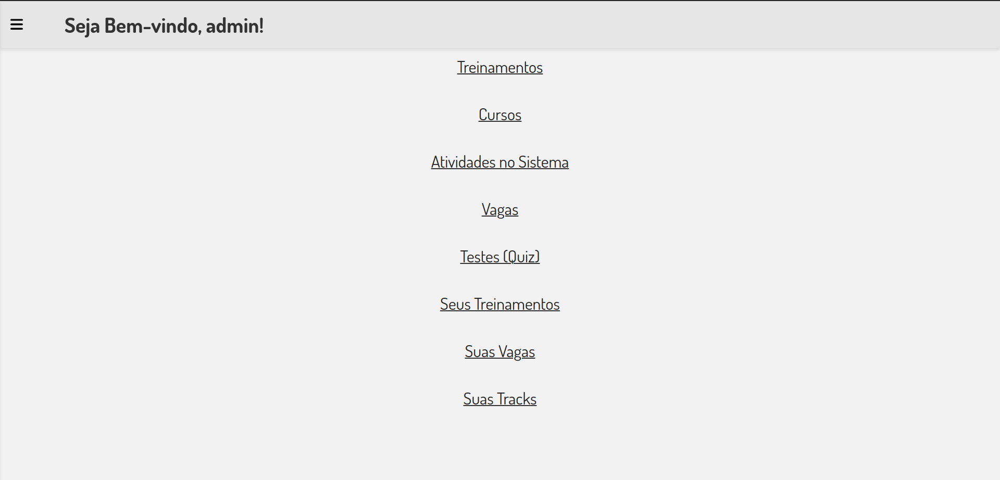

**Home page**: This is the home page. Built with a modern and intuitive design, the app provides a seamless user experience.

<br>
<br>
<br>

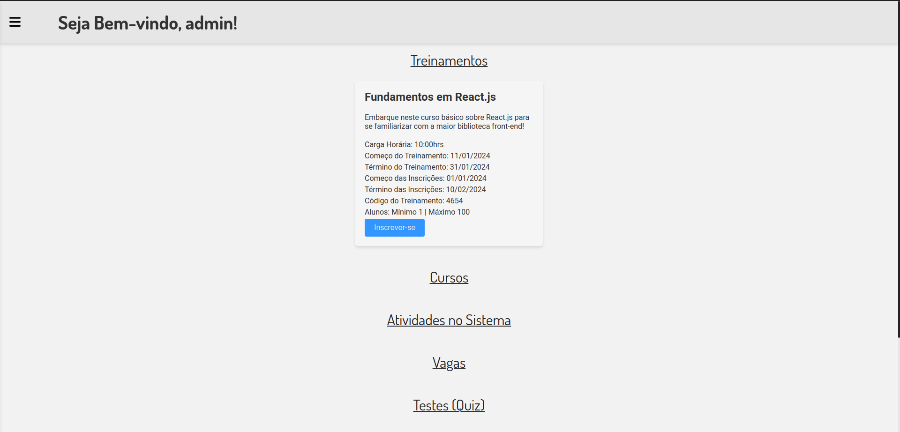

**Trainings**: The trainings section is the most important part of the system. This is where users can register for various trainings published by administrators.

<br>
<br>
<br>

<div style="display: flex;">
  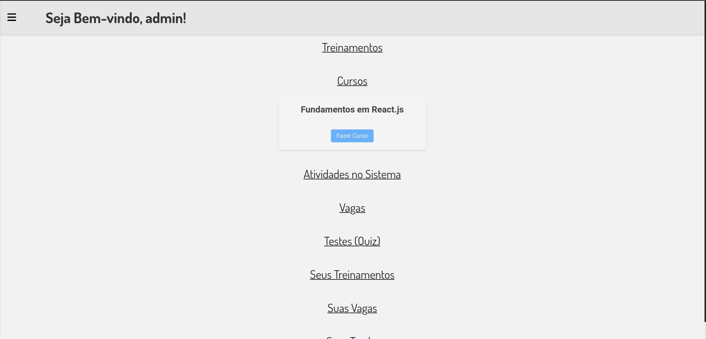
  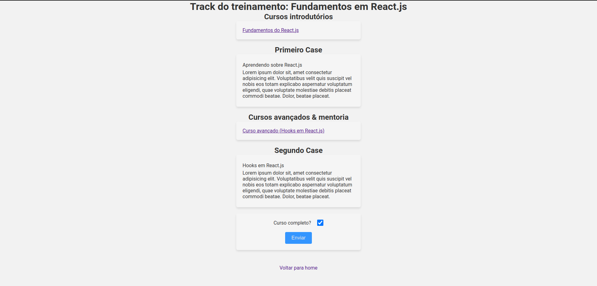
</div>

**Courses**: Users can join courses published by administrators. The course track includes introductory courses, first case, advanced courses, and second case, and can only be unlocked after the candidate has passed the test (quiz).

<br>
<br>
<br>

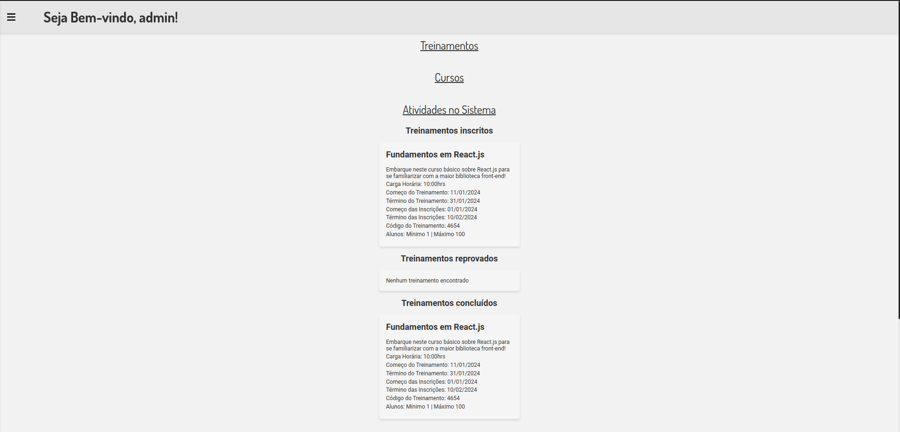

**System Activity**: The system activity section is where partner companies and administrators monitor how their candidates are going on tests and courses. This includes the courses and trainings they have joined, and the quizzes they have taken.

<br>
<br>
<br>

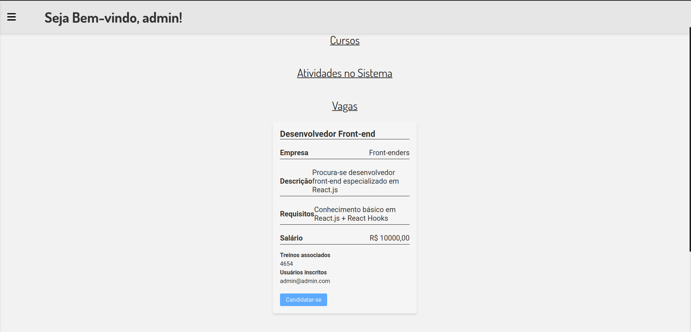

**Jobs**: After passing the test (quiz) and completing the entire course track, users can apply for jobs that partner companies advertise in the system, with each job associated with one or more training courses.

<br>
<br>
<br>

<div style="display: flex;">
  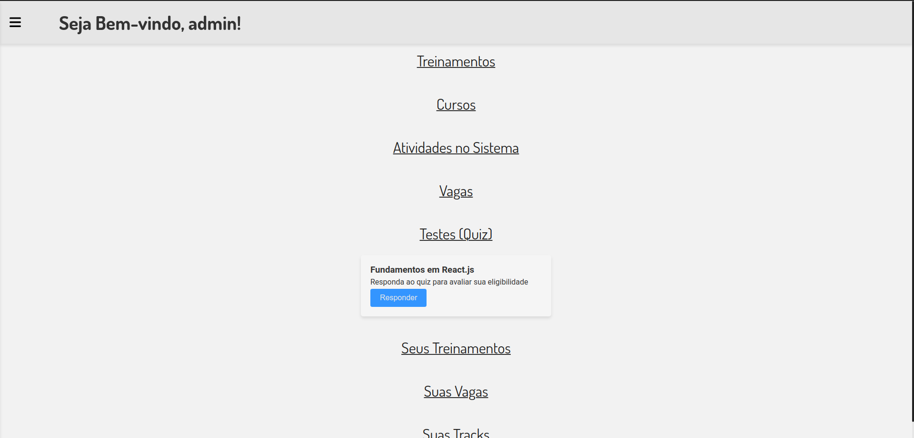
  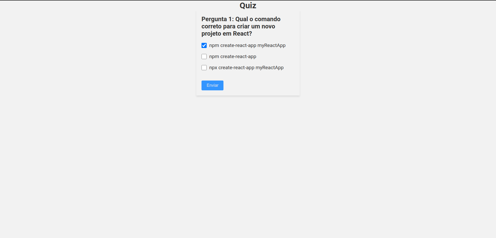
</div>

**Quiz**: The test (or quiz) is used to check whether the user will be able to proceed to more advanced stages of training or not. The minimum number of correct answers for approval is 70%.

<br>
<br>
<br>

<div style="display: flex;">
  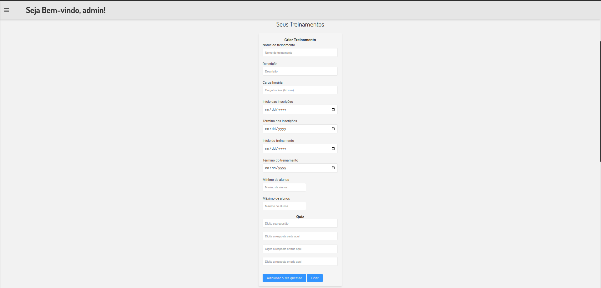
  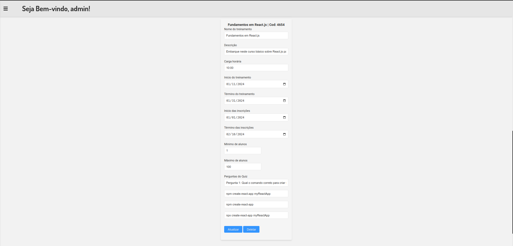
</div>

**Your Trainings**: Administrators and companies can have an overview of all information about their training and quizzes, and even update, delete, or create a new training.

<br>
<br>
<br>

<div style="display: flex;">
  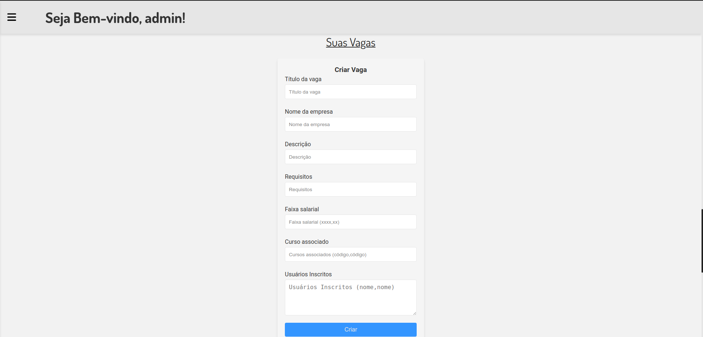
  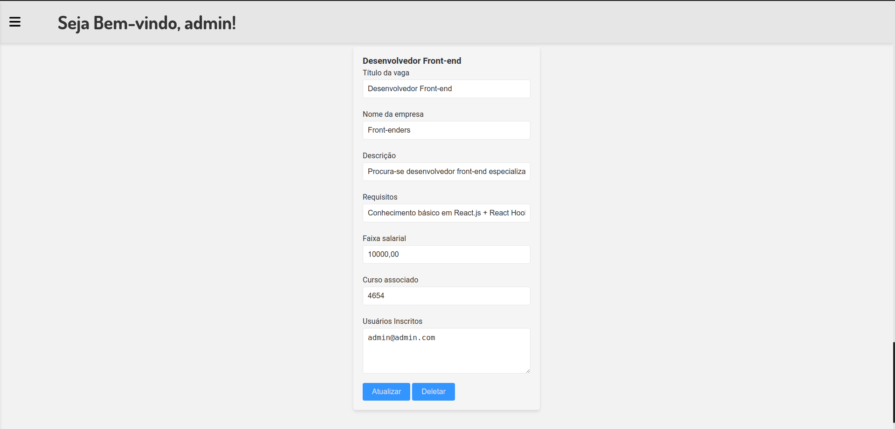
</div>

**Your Jobs**: Administrators and companies can have an overview of all information about their jobs, and even update, delete, or create a new job.

<br>
<br>
<br>

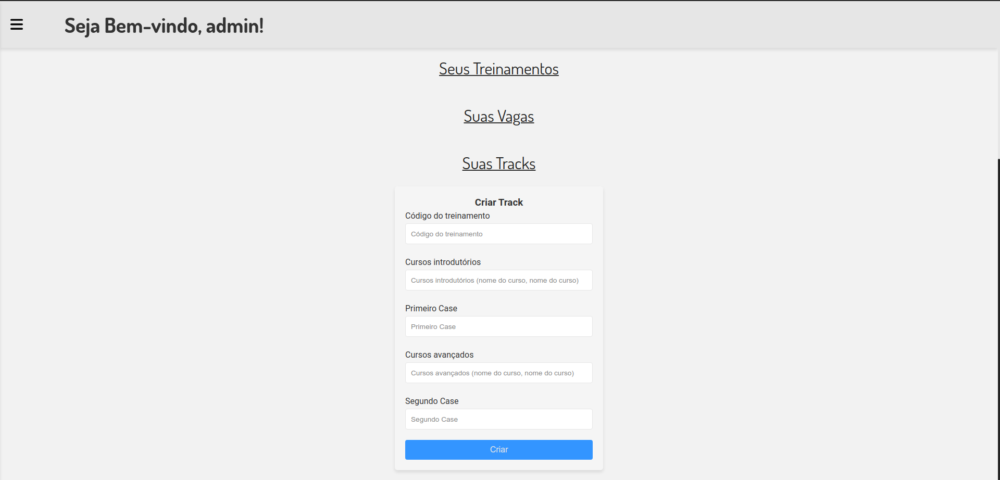

**Your Tracks**: Administrators can create course tracks for one or more training at a time.

<br>
<br>
<br>

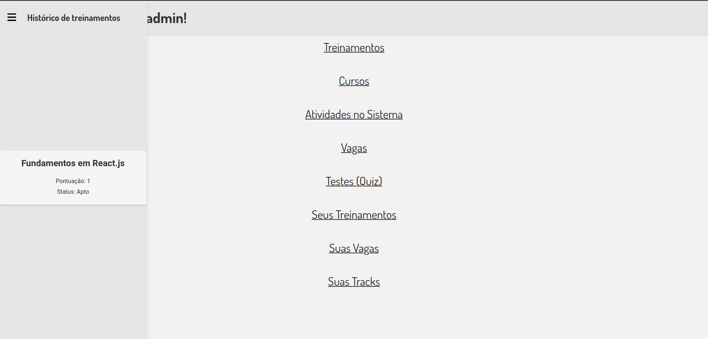

**Trainings Report**: The training history stores all the training that users have participated in, with their grades and whether or not they were able to continue the training

### Server-Side Technologies

- **Node.js**: Runtime environment to execute server-side JavaScript code.

- **Express.js**: Node.js framework for building robust web applications and RESTful APIs.

- **Database**: MongoDB for storing user accounts and data for: enrollments, jobs, tracks, trainings, and more.

### Client-Side Technologies

- **HTML/CSS/JavaScript**: Core web technologies for the user interface.

## Development Process

The project was developed using an agile approach, with a focus on flexibility and adaptability. The development process was divided into 14 sprints. The project was managed using a Kanban project template for agile development inside GitHub and GitHub itself for version control.

## Development Structure

1. **Clear Project Goals**: Understand user needs and outline project goals.

2. **Agile Development**: Adopt an agile approach for flexibility and adaptability.

3. **Testing and Security**: Implement robust testing and prioritize security.

4. **Scalability and Performance**: Design for scalability and optimize performance.

5. **Documentation and Support**: Provide user-friendly documentation and support channels.

## Development Information

- **Timeline**: 4 months development plan with milestones.

- **Learning**: Continuously enhance skills through online resources.

- **Risk Assessment**: Proactively identify and mitigate potential challenges.

- **User Interface**: Prioritize an intuitive and user-friendly design.

- **Scalability**: Plan for future growth and user scalability.

- **Individual Development**: Solo development with Git version control and project management tools.

- **User Feedback**: Incorporate user testing and feedback.

## Development Tools

- **Version Control**: Git.

- **Code Repository**: GitHub.

- **Code Editor**: Visual Studio Code.

---
